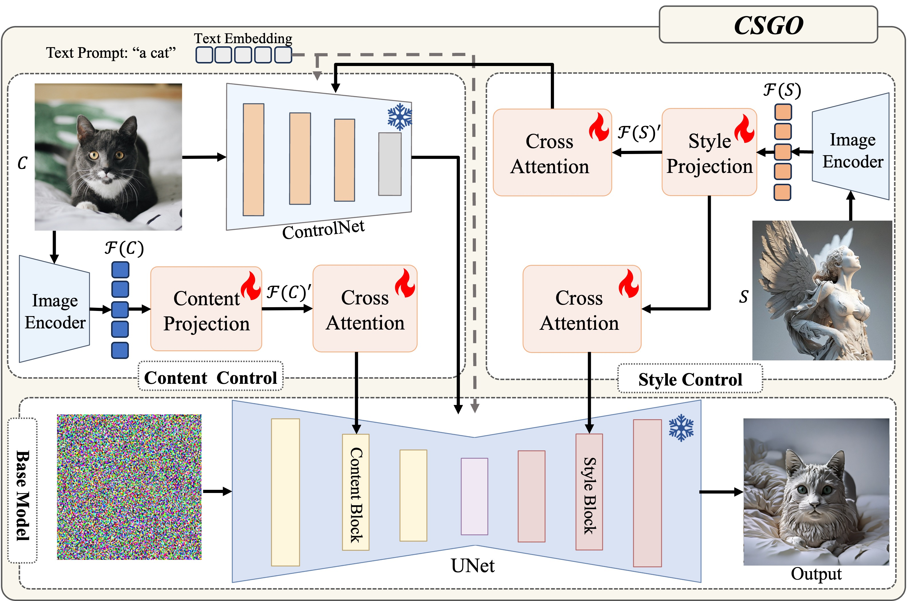
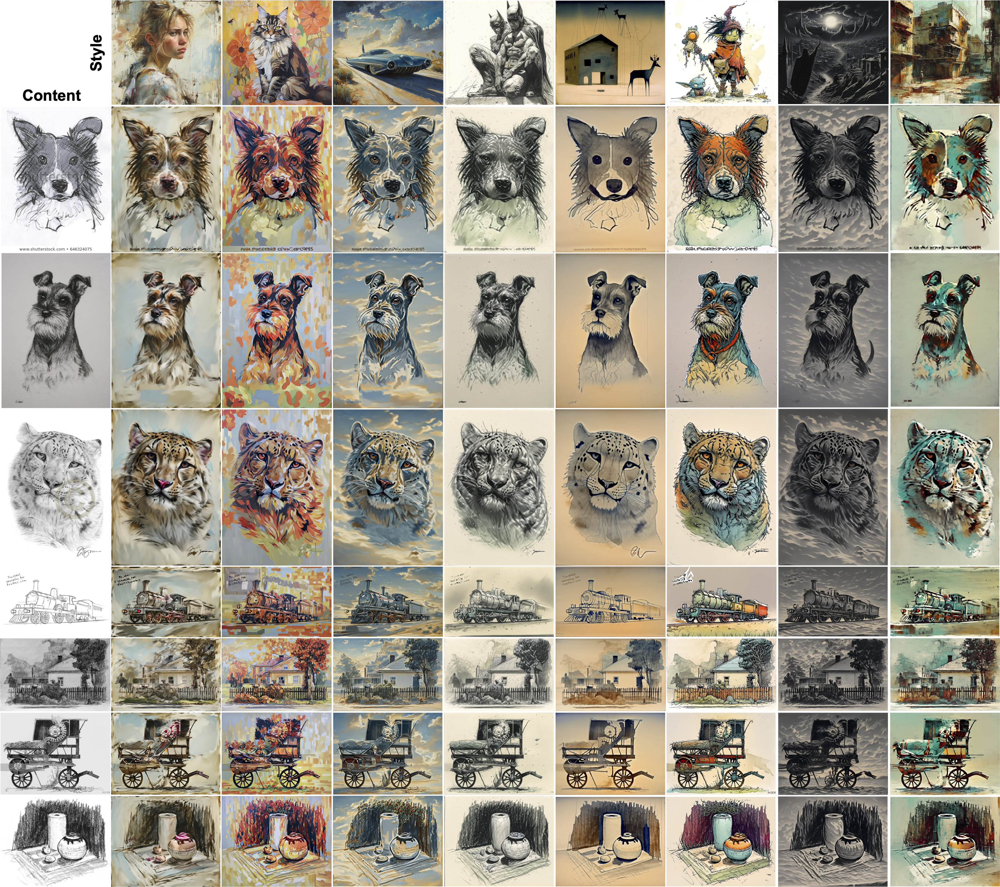
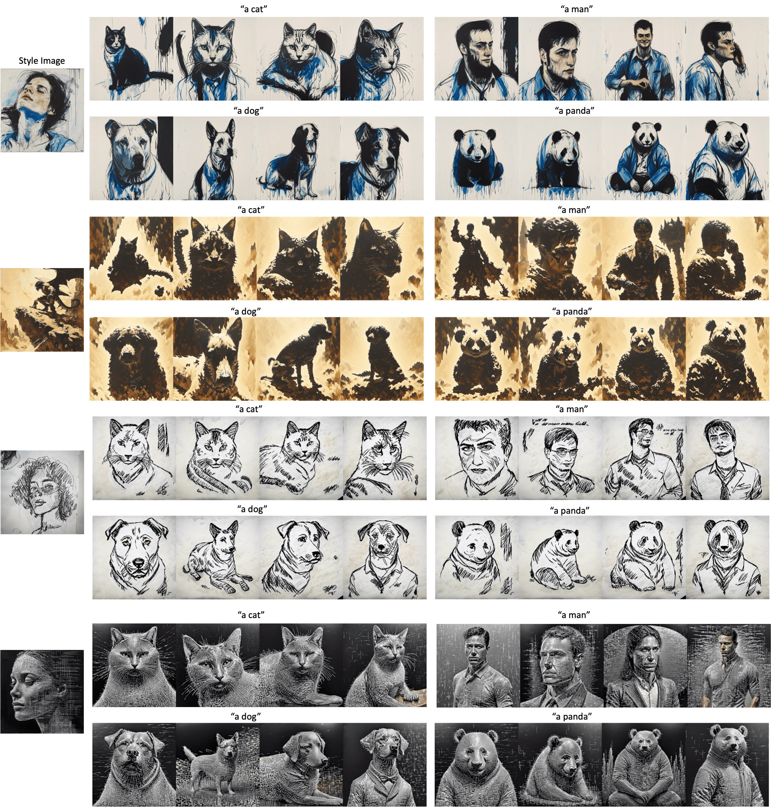

<div align="center">
<h1>CSGO: Content-Style Composition in Text-to-Image Generation</h1>

[**Peng Xing**](https://github.com/xingp-ng)<sup>12*</sup> · [**Haofan Wang**](https://haofanwang.github.io/)<sup>1*</sup> · [**Yanpeng Sun**](https://scholar.google.com.hk/citations?user=a3FI8c4AAAAJ&hl=zh-CN&oi=ao/)<sup>2</sup> · [**Qixun Wang**](https://github.com/wangqixun)<sup>1</sup> · [**Xu Bai**](https://huggingface.co/baymin0220)<sup>1</sup> · [**Hao Ai**](https://github.com/aihao2000)<sup>13</sup> · [**Renyuan Huang**](https://github.com/DannHuang)<sup>14</sup> · [**Zechao Li**](https://zechao-li.github.io/)<sup>2✉</sup>

<sup>1</sup>InstantX Team · <sup>2</sup>Nanjing University of Science and Technology · <sup>3</sup>Beihang University · <sup>4</sup>Peking University

<sup>*</sup>equal contributions, <sup>✉</sup>corresponding authors

<a href='https://csgo-gen.github.io/'></a>
<a href='https://arxiv.org/abs/2404.02733'></a>
[](https://huggingface.co/InstantX/CSGO)
[](https://huggingface.co/spaces/xingpng/CSGO/)
[](https://github.com/instantX-research/CSGO)
</div>


##  Updates 🔥

[//]: # (- **`2024/07/19`**: ✨ We support 🎞️ portrait video editing &#40;aka v2v&#41;! More to see [here]&#40;assets/docs/changelog/2024-07-19.md&#41;.)

[//]: # (- **`2024/07/17`**: 🍎 We support macOS with Apple Silicon, modified from [jeethu]&#40;https://github.com/jeethu&#41;'s PR [#143]&#40;https://github.com/KwaiVGI/LivePortrait/pull/143&#41;.)

[//]: # (- **`2024/07/10`**: 💪 We support audio and video concatenating, driving video auto-cropping, and template making to protect privacy. More to see [here]&#40;assets/docs/changelog/2024-07-10.md&#41;.)

[//]: # (- **`2024/07/09`**: 🤗 We released the [HuggingFace Space]&#40;https://huggingface.co/spaces/KwaiVGI/liveportrait&#41;, thanks to the HF team and [Gradio]&#40;https://github.com/gradio-app/gradio&#41;!)
[//]: # (Continuous updates, stay tuned!)
- **`2024/09/04`**: 🔥 We released the gradio code. You can simply configure it and use it directly.
- **`2024/09/03`**: 🔥 We released the online demo on [Hugggingface](https://huggingface.co/spaces/xingpng/CSGO/).
- **`2024/09/03`**: 🔥 We released the [pre-trained weight](https://huggingface.co/InstantX/CSGO).
- **`2024/09/03`**: 🔥 We released the initial version of the inference code.
- **`2024/08/30`**: 🔥 We released the technical report on [arXiv](https://arxiv.org/pdf/2408.16766)
- **`2024/07/15`**: 🔥 We released the [homepage](https://csgo-gen.github.io).

##   Plan 💪
- [x]  technical report
- [x]  inference code
- [x]  pre-trained weight [4_16]
- [x]  pre-trained weight [4_32]
- [x]  online demo
- [ ]  IMAGStyle dataset
- [ ]  training code
- [ ]  more pre-trained weight 

## Introduction 📖
This repo, named **CSGO**, contains the official PyTorch implementation of our paper [CSGO: Content-Style Composition in Text-to-Image Generation](https://arxiv.org/pdf/).
We are actively updating and improving this repository. If you find any bugs or have suggestions, welcome to raise issues or submit pull requests (PR) 💖.

## Pipeline 	💻
<p align="center">
  
</p>

## Capabilities 🚅 

  🔥 Our CSGO achieves **image-driven style transfer, text-driven stylized synthesis, and text editing-driven stylized synthesis**.

  🔥 For more results, visit our <a href="https://csgo-gen.github.io"><strong>homepage</strong></a> 🔥

<p align="center">
  
</p>


## Getting Started 🏁
### 1. Clone the code and prepare the environment
```bash
git clone https://github.com/instantX-research/CSGO
cd CSGO

# create env using conda
conda create -n CSGO python=3.9
conda activate CSGO

# install dependencies with pip
# for Linux and Windows users
pip install -r requirements.txt
```

### 2. Download pretrained weights

The easiest way to download the pretrained weights is from HuggingFace:
```bash
# first, ensure git-lfs is installed, see: https://docs.github.com/en/repositories/working-with-files/managing-large-files/installing-git-large-file-storage
git lfs install
# clone and move the weights
git clone https://huggingface.co/InstanX/CSGO CSGO
```
Our method is fully compatible with [SDXL](https://huggingface.co/stabilityai/stable-diffusion-xl-base-1.0), [VAE](https://huggingface.co/madebyollin/sdxl-vae-fp16-fix), [ControlNet](https://huggingface.co/TTPlanet/TTPLanet_SDXL_Controlnet_Tile_Realistic), and [Image Encoder](https://huggingface.co/h94/IP-Adapter/tree/main/sdxl_models/image_encoder).
Please download them and place them in the ./base_models folder.

tips:If you expect to load Controlnet directly using ControlNetPipeline as in CSGO, do the following:
```bash
git clone https://huggingface.co/TTPlanet/TTPLanet_SDXL_Controlnet_Tile_Realistic
mv TTPLanet_SDXL_Controlnet_Tile_Realistic/TTPLANET_Controlnet_Tile_realistic_v2_fp16.safetensors TTPLanet_SDXL_Controlnet_Tile_Realistic/diffusion_pytorch_model.safetensors
```
### 3. Inference 🚀

```python
import torch
from ip_adapter.utils import BLOCKS as BLOCKS
from ip_adapter.utils import controlnet_BLOCKS as controlnet_BLOCKS
from PIL import Image
from diffusers import (
    AutoencoderKL,
    ControlNetModel,
    StableDiffusionXLControlNetPipeline,

)
from ip_adapter import CSGO


device = torch.device("cuda:0" if torch.cuda.is_available() else "cpu")

base_model_path =  "./base_models/stable-diffusion-xl-base-1.0"  
image_encoder_path = "./base_models/IP-Adapter/sdxl_models/image_encoder"
csgo_ckpt = "./CSGO/csgo.bin"
pretrained_vae_name_or_path ='./base_models/sdxl-vae-fp16-fix'
controlnet_path = "./base_models/TTPLanet_SDXL_Controlnet_Tile_Realistic"
weight_dtype = torch.float16


vae = AutoencoderKL.from_pretrained(pretrained_vae_name_or_path,torch_dtype=torch.float16)
controlnet = ControlNetModel.from_pretrained(controlnet_path, torch_dtype=torch.float16,use_safetensors=True)
pipe = StableDiffusionXLControlNetPipeline.from_pretrained(
    base_model_path,
    controlnet=controlnet,
    torch_dtype=torch.float16,
    add_watermarker=False,
    vae=vae
)
pipe.enable_vae_tiling()


target_content_blocks = BLOCKS['content']
target_style_blocks = BLOCKS['style']
controlnet_target_content_blocks = controlnet_BLOCKS['content']
controlnet_target_style_blocks = controlnet_BLOCKS['style']

csgo = CSGO(pipe, image_encoder_path, csgo_ckpt, device, num_content_tokens=4,num_style_tokens=32,
                          target_content_blocks=target_content_blocks, target_style_blocks=target_style_blocks,controlnet=False,controlnet_adapter=True,
                              controlnet_target_content_blocks=controlnet_target_content_blocks, 
                              controlnet_target_style_blocks=controlnet_target_style_blocks,
                              content_model_resampler=True,
                              style_model_resampler=True,
                              load_controlnet=False,

                              )

style_name = 'img_0.png'
content_name = 'img_0.png'
style_image = "../assets/{}".format(style_name)
content_image = Image.open('../assets/{}'.format(content_name)).convert('RGB')

caption ='a small house with a sheep statue on top of it'

num_sample=4

#image-driven style transfer
images = csgo.generate(pil_content_image= content_image, pil_style_image=style_image,
                           prompt=caption,
                           negative_prompt= "text, watermark, lowres, low quality, worst quality, deformed, glitch, low contrast, noisy, saturation, blurry",
                           content_scale=1.0,
                           style_scale=1.0,
                           guidance_scale=10,
                           num_images_per_prompt=num_sample,
                           num_samples=1,
                           num_inference_steps=50,
                           seed=42,
                           image=content_image.convert('RGB'),
                           controlnet_conditioning_scale=0.6,
                          )

#text-driven stylized synthesis
caption='a cat'
images = csgo.generate(pil_content_image= content_image, pil_style_image=style_image,
                           prompt=caption,
                           negative_prompt= "text, watermark, lowres, low quality, worst quality, deformed, glitch, low contrast, noisy, saturation, blurry",
                           content_scale=1.0,
                           style_scale=1.0,
                           guidance_scale=10,
                           num_images_per_prompt=num_sample,
                           num_samples=1,
                           num_inference_steps=50,
                           seed=42,
                           image=content_image.convert('RGB'),
                           controlnet_conditioning_scale=0.01,
                          )

#text editing-driven stylized synthesis
caption='a small house'
images = csgo.generate(pil_content_image= content_image, pil_style_image=style_image,
                           prompt=caption,
                           negative_prompt= "text, watermark, lowres, low quality, worst quality, deformed, glitch, low contrast, noisy, saturation, blurry",
                           content_scale=1.0,
                           style_scale=1.0,
                           guidance_scale=10,
                           num_images_per_prompt=num_sample,
                           num_samples=1,
                           num_inference_steps=50,
                           seed=42,
                           image=content_image.convert('RGB'),
                           controlnet_conditioning_scale=0.4,
                          )
```
### 4 Gradio interface ⚙️

We also provide a Gradio <a href='https://github.com/gradio-app/gradio'></a> interface for a better experience, just run by:

```bash
# For Linux and Windows users (and macOS)
python gradio/app.py 
```
If you don't have the resources to configure it, we provide an online [demo](https://huggingface.co/spaces/xingpng/CSGO/).
## Demos
<p align="center">
  <br>
  🔥 For more results, visit our <a href="https://csgo-gen.github.io"><strong>homepage</strong></a> 🔥
</p>

### Content-Style Composition
<p align="center">
  
</p>

<p align="center">
  
</p>

### Cycle Translation
<p align="center">
  
</p>

### Text-Driven Style Synthesis
<p align="center">
  
</p>

### Text Editing-Driven Style Synthesis
<p align="center">
  
</p>

## Star History
[](https://star-history.com/#instantX-research/CSGO&Date)


## Acknowledgements
This project is developed by InstantX Team, all copyright reserved.

## Citation 💖
If you find CSGO useful for your research, welcome to 🌟 this repo and cite our work using the following BibTeX:
```bibtex
@article{xing2024csgo,
       title={CSGO: Content-Style Composition in Text-to-Image Generation}, 
       author={Peng Xing and Haofan Wang and Yanpeng Sun and Qixun Wang and Xu Bai and Hao Ai and Renyuan Huang and Zechao Li},
       year={2024},
       journal = {arXiv 2408.16766},
}
```